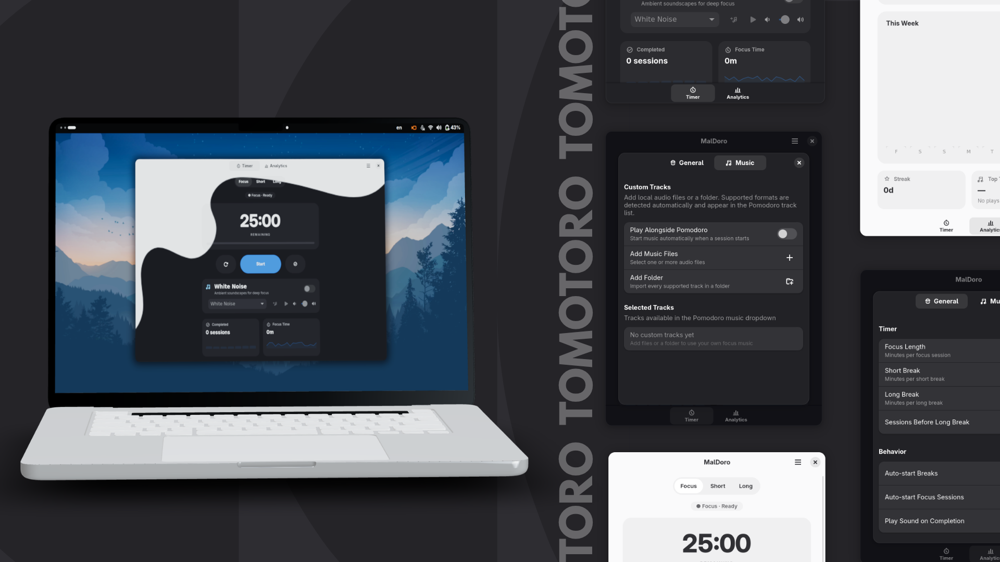

# Tomotoro Pomodoro 🍅

**Boost your productivity with custom focus sessions, break tracking, and ambient soundscapes.**

  

---

## 👋 What is this?

Hey! **Tomotoro** is a minimal, distraction-free Pomodoro timer built because I wanted something sleek that fits right into a clean desktop workflow. No bloated web wrappers, just native-feeling focus tools with built-in ambient white noise, and session analytics.

---

## ✨ Features

- **Focus Timer:** Clean intervals with smooth state transitions (Focus, Short Break, Long Break).
- **Ambient Soundscapes:** Built-in white noise and local audio support to keep you locked in.
- **Session Analytics:** Track your daily/weekly focus time and streaks right inside the app.
